<!-- ╔══════════════════════════════════════════════════════╗ -->
<!-- ║  TUHIN KUMAR SINGHA ROY — GitHub Profile README     ║ -->
<!-- ║  Theme: Neural Architect · Dark Cyberpunk Terminal   ║ -->
<!-- ╚══════════════════════════════════════════════════════╝ -->

<!-- ═══════════════════════ ANIMATED HEADER ═══════════════════════ -->
<div align="center">

</div>
<!-- ═══════════════════════ TYPING ANIMATION ═══════════════════════ -->
<div align="center">


<br/>

[](https://github.com/Tuhin108)
&nbsp;
[](https://github.com/Tuhin108?tab=followers)
&nbsp;


</div>

<br/>

<!-- ═══════════════════════ NEURAL NETWORK ANIMATION ═══════════════════════ -->
<div align="center">
  
</div>

<br/>

---

<!-- ═══════════════════════ BOOT SEQUENCE ═══════════════════════ -->

```bash
$ ./tuhin --init --mode=full

[██████████████████████████████] 100%

✓  AI/ML Engineer        ::  10+ production-grade models built
✓  GenAI Architect       ::  RAG · LangChain · Gemini API · Mistral
✓  AWS Cloud Practitioner::  EC2 · S3 · Lambda · IAM · Autoscaling
✓  Deep Learning         ::  TensorFlow · CNN · NLP · Computer Vision
✓  Hackathon Winner      ::  SIH 2024 College Internal Champion 🏆
✓  Content Creator       ::  YouTube → "Tuhin in AIML" | Active
✓  Location              ::  Kolkata, West Bengal, India 🇮🇳

> System Ready.  All modules loaded.
```

---

<!-- ═══════════════════════ ABOUT — PYTHON CLASS ═══════════════════════ -->

## 🧠 &nbsp;`tuhin.execute()`

```python
class TuhinKumarSinghaRoy:
    """
    ╔═══════════════════════════════════════════════════════════╗
    ║         NEURAL ARCHITECT  &  AI SYSTEMS BUILDER           ║
    ║   "Architecting intelligence, one model at a time."       ║
    ╚═══════════════════════════════════════════════════════════╝
    """

    def __init__(self):
        self.name         = "Tuhin Kumar Singha Roy"
        self.role         = "AI/ML Engineer · GenAI Builder · Neural Architect"
        self.location     = "📍 Kolkata, West Bengal, India 🇮🇳"
        self.education    = "🎓 B.Tech CSE (AI & ML)  @  MCKV Institute of Engineering"
        self.cgpa         = 8.35
        self.youtube      = "▶️  'Tuhin in AIML'  |  Active AI/ML Content Creator"
        self.linkedin     = "linkedin.com/in/tuhininaiml"

    def current_mission(self) -> list[str]:
        return [
            "🔬  Architecting Agentic RAG & LangChain-powered AI Systems",
            "☁️   Deploying scalable AI on AWS Cloud (EC2, S3, Lambda)",
            "🤖  Building production LLM applications with Gemini & Mistral API",
            "📊  Teaching ML & Python @ Ardent Computech Pvt. Ltd., Kolkata",
        ]

    def achievements(self) -> dict:
        return {
            "projects_built"       : "10+ AI/ML/GenAI Projects",
            "hackathon_winner"     : "🏆 SIH 2024 — College Internal Hackathon Champion",
            "competition"          : "🥈 BrainVerse 2025 — 2nd Place",
            "cnn_plant_disease"    : "85%+ Accuracy · 38 Classes · 63,000+ Images",
            "aws_grade"            : "A+  in Cloud Architecture & Operational Excellence",
            "crop_ml_pipeline"     : "90% Prediction Accuracy · 1000+ Farm Records",
            "netflix_predictor"    : "95%+ Accuracy, Precision, Recall & F1 Score",
        }

    def get_stack(self) -> dict:
        return {
            "Languages"   : ["Python", "SQL", "HTML/CSS", "JavaScript"],
            "AI & ML"     : ["TensorFlow", "Keras", "scikit-learn", "NLP", "Computer Vision"],
            "GenAI"       : ["LangChain", "RAG Architecture", "Gemini API", "Mistral API", "Prompt Engineering"],
            "Cloud"       : ["AWS EC2", "S3", "Lambda", "IAM", "Autoscaling", "Serverless"],
            "Web & Data"  : ["Flask", "FastAPI", "Streamlit", "Pandas", "NumPy", "Matplotlib"],
        }

    def __repr__(self) -> str:
        return "Building AI that thinks deeper. 🚀"
```

<br/>

---

<!-- ═══════════════════════ STATUS CARDS ═══════════════════════ -->

## ⚡ &nbsp;`system.status()`

<table align="center" border="0" cellspacing="0" cellpadding="12">
<tr>
<td align="center" width="200">

**🔭 Building Now**
```
Agentic RAG Systems
LangChain + Gemini API
```

</td>
<td align="center" width="200">

**🌱 Deep-Diving Into**
```
Advanced MLOps
LLM Fine-Tuning
```

</td>
<td align="center" width="200">

**🎯 2025–26 Target**
```
Open Source Impact
AI Research Paper
```

</td>
</tr>
<tr>
<td align="center">

**🌿 Flagship Model**
```
CNN · 38 Disease Classes
85%+ Acc · 63K Images
```

</td>
<td align="center">

**📺 Content Creator**
```
▶️ Tuhin in AIML
AI · ML · AWS · Python
```

</td>
<td align="center">

**🏆 Hackathon Glory**
```
SIH 2024 Winner 🥇
Farmer Sales App
```

</td>
</tr>
</table>

<br/>

---

<!-- ═══════════════════════ TECH STACK ═══════════════════════ -->

## 🛠️ &nbsp;`tech.stack()`

<div align="center">

### `// Languages`


### `// AI · ML · Deep Learning`


### `// Cloud & DevOps`


### `// Web · Data · Frameworks`


<br/>

### `// GenAI & Specialized`


</div>

<br/>

---

<!-- ═══════════════════════ GITHUB STATS ═══════════════════════ -->

## 📊 &nbsp;`github.diagnostics()`

<div align="center">


&nbsp;&nbsp;


<br/><br/>


<br/><br/>
</div>

<br/>

---

<!-- ═══════════════════════ ACTIVITY GRAPH ═══════════════════════ -->

## 📈 &nbsp;`neural.activity_graph()`

<div align="center">

</div>

<br/>

---

<!-- ═══════════════════════ FEATURED PROJECTS ═══════════════════════ -->

## 🚀 &nbsp;`projects.highlight()`

<div align="center">

<table border="0" cellpadding="14">
<tr>
<td width="50%" valign="top">

### 🧪 [Deep Research Assistant](https://github.com/Tuhin108/Deep-Research-Assistant)

> **`Python · LangChain · Gemini API · Streamlit`**

Production-ready **Agentic RAG** system for deep, context-aware analysis of large-scale multi-document PDF sets. Persistent conversation history + optimized pipeline for complex queries.


</td>
<td width="50%" valign="top">

### 🌿 [Plant Disease Detection CNN](https://github.com/Tuhin108/plant_disease_prediction_model)

> **`Python · TensorFlow · CNN · Streamlit`**

Specialized CNN classifying **38 disease classes** with **85%+ accuracy**, trained on 63,000+ agricultural images. Deployed via Streamlit for real-time field diagnosis.


</td>
</tr>
<tr>
<td width="50%" valign="top">

### 📈 [AI Trading System](https://github.com/Tuhin108/AI-Trading-System)

> **`Python · TensorFlow · Time Series · scikit-learn`**

AI trading system with real-time signals via **TensorFlow** trend prediction, proprietary **backtester** for continuous training evaluation, Google Sheets logging + Telegram Bot alerts.


</td>
<td width="50%" valign="top">

### 🎬 [Netflix Content Predictor](https://github.com/Tuhin108/Netflix-Content-Type-Predictor)

> **`Python · scikit-learn · Pandas · Seaborn`**

Logistic Regression on **7,789 Netflix titles** achieving **95%+ Accuracy, Precision, Recall & F1**. Feature engineering across 53 variables with full EDA pipeline.


</td>
</tr>
<tr>
<td width="50%" valign="top">

### 🤖 [Hiring Nexus — Neural Interface](https://github.com/Tuhin108/Hiring-Nexus)

> **`Python · Flask · Gemini API`**

AI-powered recruitment web app using **Gemini API** for intelligent candidate filtering & summary generation. Custom scoring system achieving **90%+ matching accuracy**.


</td>
<td width="50%" valign="top">

### 📚 [Askademia — Research AI Agent](https://github.com/Tuhin108/Askademia)

> **`Streamlit · Google GenAI · PyMuPDF · ArXiv API`**

Enterprise-grade GenAI agent for document Q&A + ArXiv paper analysis. Multi-modal processing extracts text, tables & figures. Integrated directly with **ArXiv API** for live research.


</td>
</tr>
</table>

</div>

<br/>

---

<!-- ═══════════════════════ EXPERIENCE TIMELINE ═══════════════════════ -->

## 🧭 &nbsp;`career.timeline()`

```
──────────────────────────────────────────────────────────────────────
  Jan 2026 → Present   │ 🏢  Ardent Computech Pvt. Ltd.
  Technical Intern      │     Teaching ML, Python, Data Viz, DSA
──────────────────────────────────────────────────────────────────────
  Jul 2025 → Oct 2025   │ ☁️  IEMA Research & IEMLabs (AWS Cloud)
  Cloud Practitioner    │     40-hr AWS program · A+ Grade Achieved
──────────────────────────────────────────────────────────────────────
  Jan 2025 → Aug 2025   │ 🤖  Hive Tech (AI/ML Intern)
  AI/ML Engineer        │     LLMs · AWS EC2/S3 · MLOps Protocols
──────────────────────────────────────────────────────────────────────
  Dec 2024 → Feb 2025   │ 🌿  Edunet Foundation (AICTE)
  AI/ML Intern          │     CNN Plant Disease · Flask API · 90% Acc
──────────────────────────────────────────────────────────────────────
  Sep 2025 → Oct 2025   │ 📊  Edunet Foundation / AICTE (VOIS Program)
  Data Analytics Intern │     Conversational Analytics with LLMs
──────────────────────────────────────────────────────────────────────
```

<br/>

---

<!-- ═══════════════════════ CERTIFICATIONS ═══════════════════════ -->

## 🎓 &nbsp;`certifications.load()`

<div align="center">


</div>

<br/>

---

<!-- ═══════════════════════ CONNECT SECTION ═══════════════════════ -->

## 🌐 &nbsp;`tuhin.connect()`

<div align="center">

[](https://linkedin.com/in/tuhininaiml)
&nbsp;
[](https://youtube.com/@tuhininaiml)
&nbsp;
[](https://tuhin108.github.io)

<br/><br/>

```
╔═════════════════════════════════════════════════════════════════════╗
║                                                                     ║
║   "Every neural network starts with a single weight.               ║
║    Every great AI system starts with a single line of code."       ║
║                                                                     ║
║                                             — Tuhin, probably  🚀  ║
╚═════════════════════════════════════════════════════════════════════╝
```

<br/>

*If my work sparked something in you — a star ⭐ means the world.*

</div>

<!-- ═══════════════════════ FOOTER WAVE ═══════════════════════ -->

